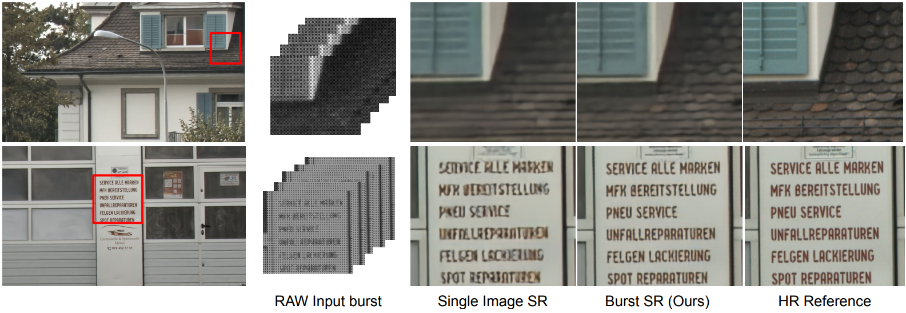

# Deep-Burst-SR

Official implementation of [**Deep Burst Super-Resolution**](https://arxiv.org/pdf/2101.10997.pdf)

**News:**
- The code for our ICCV 2021 oral paper ["Deep Reparametrization of Multi-Frame Super-Resolution and Denoising"](https://arxiv.org/pdf/2108.08286.pdf) is now available at [goutamgmb/deep-rep](https://github.com/goutamgmb/deep-rep) 
- The complete training code is available now!

**Publication:** Deep Burst Super-Resolution. Goutam Bhat, Martin Danelljan, Luc Van Gool, and Radu Timofte. CVPR 2021 
[[Arxiv](https://arxiv.org/pdf/2101.10997.pdf)]

## Overview

While single-image super-resolution (SISR) has attracted substantial interest in recent years, the proposed
approaches are limited to learning image priors in order to add high frequency details. In contrast, multi-frame superresolution (MFSR) offers the possibility of reconstructing
rich details by combining signal information from multiple
shifted images. This key advantage, along with the increasing popularity of burst photography, have made MFSR an
important problem for real-world applications.
We propose a novel architecture for the burst superresolution task. Our network takes multiple noisy RAW
images as input, and generates a denoised, super-resolved
RGB image as output. This is achieved by explicitly aligning
deep embeddings of the input frames using pixel-wise optical flow. The information from all frames are then adaptively merged using an attention-based fusion module. In
order to enable training and evaluation on real-world data,
we additionally introduce the BurstSR dataset, consisting of
smartphone bursts and high-resolution DSLR ground-truth.


[Comparison of our Deep Burst SR apporach with Single Image baseline for 4x super-resolution of RAW burst captured from Samsung Galaxy S8]

## Table of Contents

* [Installation](#installation)
* [Toolkit Overview](#toolkit-overview)
* [Datasets](#datasets)
* [Evaluation](#evaluation)
* [Model Zoo](#model-zoo)
* [Training](#training)
* [Acknowledgement](#acknowledgement)

## Installation

#### Clone the Git repository.  
```bash
git clone https://github.com/goutamgmb/deep-burst-sr.git
```
   
#### Install dependencies
Run the installation script to install all the dependencies. You need to provide the conda install path (e.g. ~/anaconda3) and the name for the created conda environment (here ```env-dbsr```).  
```bash
bash install.sh conda_install_path env-dbsr
```  
This script will also download the default DBSR networks and create default environment settings.  

#### Update environment settings
The environment setting file [admin/local.py](admin/local.py) contains the paths for pre-trained networks, 
datasets etc. Update the paths in [local.py](admin/local.py) according to your local environment.

## Toolkit Overview
The toolkit consists of the following sub-modules.  
 - [actors](actors): Contains the actor classes for different trainings. The actor class is responsible for passing the input data through the network can calculating losses.
 - [admin](admin): Includes functions for loading networks, tensorboard etc. and also contains environment settings.  
 - [data](data): Contains functions for generating synthetic bursts, camera pipeline, processing data (e.g. loading images, data augmentations).
 - [data_specs](data_specs): Information about train/val splits of different datasets.
 - [dataset](dataset): Contains integration of datasets such as BurstSR, SyntheticBurst, ZurichRAW2RGB. 
 - [evaluation](evaluation): Scripts to run and evaluate models on standard datasets. 
 - [external](external): External dependencies, e.g. [PWCNet](https://github.com/sniklaus/pytorch-pwc).  
 - [models](models): Contains different layers and network definitions.  
 - [train_settings](train_settings): Default training settings for different models.
 - [trainers](trainers): The main class which runs the training.
 - [util_scripts](util_scripts): Util scripts to e.g. download datasets.  
 - [utils](utils): General utility functions for e.g. plotting, data type conversions, loading networks.


## Datasets
The toolkit provides integration for following datasets which can be used to train/evaluate the models.

<details>
  <summary><b>Zurich RAW to RGB Canon set</b></summary>

The RGB images from the training split of the 
[Zurich RAW to RGB mapping dataset](http://people.ee.ethz.ch/~ihnatova/pynet.html#dataset) 
can be used to generate synthetic bursts for training using the `SyntheticBurstProcessing` class in [data/processing.py](data/processing.py).

**Preparation:** Download the Zurich RAW to RGB canon set from [here](https://data.vision.ee.ethz.ch/bhatg/zurich-raw-to-rgb.zip) and unpack the zip folder. Set the 
`zurichraw2rgb_dir` variable in [admin/local.py](admin/local.py) to point to the unpacked dataset directory.

</details>

<details>
<summary><b>SyntheticBurst validation set</b></summary>

The pre-generated synthetic validation set used for evaluating the models. The dataset contains 300 synthetic bursts, each containing 
14 RAW images. The synthetic bursts are generated from the RGB images from the test split of the Zurich RAW to RGB mapping dataset. 
The dataset can be loaded using `SyntheticBurstVal` class in [dataset/synthetic_burst_val_set.py](dataset/synthetic_burst_val_set.py) file.

**Preparation:**  Downloaded the dataset [here](https://data.vision.ee.ethz.ch/bhatg/SyntheticBurstVal.zip) and unpack the zip file. 
Set the `synburstval_dir` variable in [admin/local.py](admin/local.py) to point to the unpacked dataset directory.


</details>

<details>
<summary><b>BurstSR dataset (cropped)</b></summary> 

The BurstSR dataset containing RAW bursts captured from Samsung Galaxy S8 and corresponding HR ground truths captured using a DSLR camera. 
This is the pre-processed version of the dataset that contains roughly aligned crops from the original images.
The dataset can be loaded using `BurstSRDataset` class in [dataset/burstsr_dataset.py](dataset/burstsr_dataset.py) file.
Please check the [DBSR paper](https://arxiv.org/pdf/2101.10997.pdf) for more details.


**Preparation:** The dataset has been split into 10 parts and can be downloaded and unpacked using the 
[util_scripts/download_burstsr_dataset.py](util_scripts/download_burstsr_dataset.py) script. 
Set the `burstsr_dir` variable in [admin/local.py](admin/local.py) to point to the unpacked BurstSR dataset directory.

</details>


<details>
<summary><b>BurstSR dataset (full)</b></summary> 

The BurstSR dataset containing RAW bursts captured from Samsung Galaxy S8 and corresponding HR ground truths captured using a DSLR camera. 
This is the raw version of the dataset containing the full burst images in dng format.


**Preparation:** The dataset can be downloaded and unpacked using the [util_scripts/download_raw_burstsr_data.py](util_scripts/download_raw_burstsr_data.py) script. 

</details>

## Evaluation
You can run the trained model on RAW bursts to generate HR RGB images and compute the quality of predictions using the 
[evaluation](evaluation) module. 

**Note:** Please prepare the necessary datasets as explained in [Datasets](#Datasets) section before running the models.


<details>
<summary><b>Evaluate on SyntheticBurst validation set</b></summary> 

You can evaluate the models on SyntheticBurst validation set using [evaluation/synburst](evaluation/synburst) package. 
First create an experiment setting in [evaluation/synburst/experiments](evaluation/synburst/experiments) containing the list of 
models to evaluate. You can start with the provided setting [dbsr_default.py](evaluation/synburst/experiments/dbsr_default.py) as a reference.
Please refer to [network_param.py](evaluation/common_utils/network_param.py) for examples on how to specify a model for evaluation.

### Save network predictions
You can save the predictions of a model on bursts from SyntheticBurst dataset by running
```bash
python evaluation/synburst/save_results.py EXPERIMENT_NAME
```
Here, `EXPERIMENT_NAME` is the name of the experiment setting you want to use (e.g. `dbsr_default`). 
The script will save the predictions of the model in the directory pointed by the 
`save_data_path` variable in [admin/local.py](admin/local.py).

**Note** The network predictions are saved in linear sensor color space (i.e. color space of input RAW burst), 
as 16 bit pngs.

### Compute performance metrics
You can obtain the standard performance metrics (e.g. PSNR, MS-SSIM, LPIPS) using the 
[compute_score.py](evaluation/synburst/compute_score.py) script

```bash
python evaluation/synburst/compute_score.py EXPERIMENT_NAME
```
Here, `EXPERIMENT_NAME` is the name of the experiment setting you want to use (e.g. `dbsr_default`). 
The script will run the models to generate the predictions and compute the scores. In case you want 
to compute performance metrics for results saved using [save_results.py](evaluation/synburst/save_results.py), you 
can run [compute_score.py](evaluation/synburst/compute_score.py) with additonal `--load_saved` argument.
```bash
python evaluation/synburst/compute_score.py EXPERIMENT_NAME --load_saved
```
In this case, the script will load pre-saved predictions whenever available. If saved predictions are not available, 
it will run the model to first generate the predictions and then compute the scores.

### Qualitative comparison
You can perform qualitative analysis of the model by visualizing the saved network predictions, along with ground truth, in sRGB format 
using the [visualize_results.py](evaluation/synburst/visualize_results.py) script.
```bash
python evaluation/synburst/visualize_results.py EXPERIMENT_NAME
```
Here, `EXPERIMENT_NAME` is the name of the experiment setting containing the list of models you want to use (e.g. `dbsr_default`). 
The script will display the predictions of each model in sRGB format, along with the ground truth. You can toggle between images, 
zoom in on particular image regions using the UI. See [visualize_results.py](evaluation/synburst/visualize_results.py) for details.

**Note:** You need to first save the network predictions using [save_results.py](evaluation/synburst/save_results.py) script, 
before you can visualize them using visualize_results.py.

</details>


<details>
<summary><b>Evaluate on BurstSR validation set</b></summary> 

You can evaluate the models on BurstSR validation set using [evaluation/burstsr](evaluation/burstsr) package. 
First create an experiment setting in [evaluation/burstsr/experiments](evaluation/burstsr/experiments) containing the list of 
models to evaluate. You can start with the provided setting [dbsr_default.py](evaluation/burstsr/experiments/dbsr_default.py) as a reference. 
Please refer to [network_param.py](evaluation/common_utils/network_param.py) for examples on how to specify a model for evaluation.

### Save network predictions
You can save the predictions of a model on bursts from BurstSR val dataset by running
```bash
python evaluation/burstsr/save_results.py EXPERIMENT_NAME
```
Here, `EXPERIMENT_NAME` is the name of the experiment setting you want to use (e.g. `dbsr_default`). 
The script will save the predictions of the model in the directory pointed by the 
`save_data_path` variable in [admin/local.py](admin/local.py).

**Note** The network predictions are saved in linear sensor color space (i.e. color space of input RAW burst), 
as 16 bit pngs.

### Compute performance metrics
You can obtain the standard performance metrics (e.g. PSNR, MS-SSIM, LPIPS) **after** spatial and color alignment (see [paper]() for details)
using the [compute_score.py](evaluation/burstsr/compute_score.py) script

```bash
python evaluation/burstsr/compute_score.py EXPERIMENT_NAME
```
Here, `EXPERIMENT_NAME` is the name of the experiment setting you want to use (e.g. `dbsr_default`). 
The script will run the models to generate the predictions and compute the scores. In case you want 
to compute performance metrics for results saved using [save_results.py](evaluation/burstsr/save_results.py), you 
can run [compute_score.py](evaluation/burstsr/compute_score.py) with additonal `--load_saved` argument.
```bash
python evaluation/burstsr/compute_score.py EXPERIMENT_NAME --load_saved
```
In this case, the script will load pre-saved predictions whenever available. If saved predictions are not available, 
it will run the model to first generate the predictions and then compute the scores.

### Qualitative comparison
You can perform qualitative analysis of the model by visualizing the saved network predictions, along with ground truth, in sRGB format 
using the [visualize_results.py](evaluation/burstsr/visualize_results.py) script.
```bash
python evaluation/burstsr/visualize_results.py EXPERIMENT_NAME
```
Here, `EXPERIMENT_NAME` is the name of the experiment setting containing the list of models you want to use (e.g. `dbsr_default`). 
The script will display the predictions of each model in sRGB format, along with the ground truth. You can toggle between images, 
zoom in on particular image regions using the UI. See [visualize_results.py](evaluation/burstsr/visualize_results.py) for details.

**Note:** You need to first save the network predictions using [save_results.py](evaluation/burstsr/save_results.py) script, 
before you can visualize them using visualize_results.py.

</details>

## Model Zoo
Here, we provide pre-trained network weights and report their performance. 

**Note:** The models have been retrained using the cleaned up code, and thus can have small performance 
differences compared to the models used for the paper.

<details>
<summary><b>SyntheticBurst models</b></summary> 

The models are evaluated using all 14 burst images.

|          Model         |  PSNR | MS-SSIM | LPIPS |                                            Links                                            | Notes                    |
|:----------------------:|:-----:|:-------:|:-----:|:-------------------------------------------------------------------------------------------:|--------------------------|
| CVPR2021               | 39.09 | 0.945   | 0.084 | -                                                                                           | CVPR2021 results         |
| dbsr_synthetic_default | 39.17 | 0.946   | 0.081 | [model](https://drive.google.com/file/d/1bdtz_gr_m9MnypVqDigH6H1xoae82lwY/view?usp=sharing) | Official retrained model |

</details>

<details>
<summary><b>BurstSR models</b></summary> 

The models are evaluated using all 14 burst images. The metrics are computed after spatial and color alignment, as 
described in [DBSR paper](https://arxiv.org/pdf/2101.10997.pdf).

|          Model         |  PSNR | MS-SSIM | LPIPS |                                            Links                                            | Notes                    |
|:----------------------:|:-----:|:-------:|:-----:|:-------------------------------------------------------------------------------------------:|--------------------------|
| CVPR2021               | 47.76 | 0.984   | 0.030 | -                                                                                           | CVPR2021 results         |
| dbsr_burstsr_default | 47.70 | 0.984   | 0.029 | [model](https://drive.google.com/file/d/1GyfJzqBx9st9Qdvy2fRizWvxCbNOerFe/view?usp=sharing) | Official retrained model |

</details>

## Training 
You can train the models using the [run_training.py](run_training.py) script. 
Please download and set up the necessary datasets as described in Datasets section, before starting the trainings. You will 
also need a pre-trained PWC-Net model to start the trainings. The model is automatically downloaded from 
the `install.sh` script. You can also download it manually using

```
gdown https://drive.google.com/uc\?id\=1s11Ud1UMipk2AbZZAypLPRpnXOS9Y1KO -O pretrained_networks/pwcnet-network-default.pth
```

You can train a DBSR model on the SyntheticBurst dataset using default parameter settings using the following command
```
python run_training.py dbsr default_synthetic
```
In order to fine-tune DBSR model trained on SyntheticBurst dataset on the real-world BurstSR dataset, use the following command
```
python run_training.py dbsr default_realworld
```

## Acknowledgement
The toolkit uses code from the following projects:
- Forward and inverse camera pipeline code from [timothybrooks/unprocessing](https://github.com/timothybrooks/unprocessing).
- PWC-Net code from [sniklaus/pytorch-pwc](https://github.com/sniklaus/pytorch-pwc)
- PWC-Net pre-trained models from [NVlabs/PWC-Net](https://github.com/NVlabs/PWC-Net)
- MS-SSIM code from [jorge-pessoa/pytorch-msssim](https://github.com/jorge-pessoa/pytorch-msssim).
- Core code for the toolkit (e.g. saving and loading models) from [visionml/pytracking](https://github.com/visionml/pytracking)
